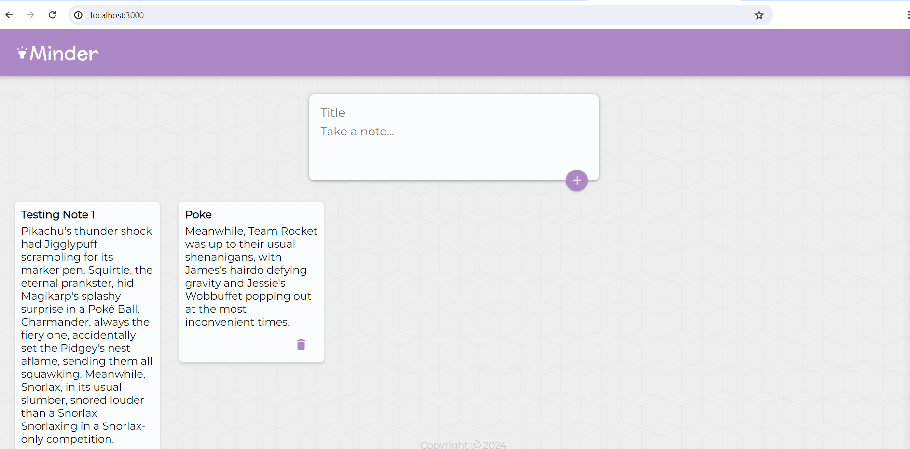

# Minder Note App

Welcome to Minder Note App! This is a simple and elegant note-taking application built with React, allowing you to jot down your thoughts, ideas, and reminders with ease.

## Features

- **Create Notes**: Easily create new notes with titles and content to capture your thoughts.
- **Delete Notes**: Remove unwanted notes with a single click.
- **Responsive Design**: Enjoy a seamless experience across devices with our responsive design.
- **Beautiful UI**: Enjoy a visually appealing user interface designed to enhance your note-taking experience.

## Usage

To get started with Minder Note App locally:

1. Clone this repository to your local machine.
2. Navigate to the project directory.
3. Install dependencies using `npm install`.
4. Start the development server using `npm start`.
5. Access the application in your browser at [http://localhost:3000](http://localhost:3000).

## Future Improvements

While the current version of Minder Note App allows you to create and delete notes locally in your browser, future updates may include:

- **Backend Integration**: Store notes securely in a backend server (e.g., MongoDB Atlas) to enable persistence across sessions.
- **User Authentication**: Implement user authentication to allow multiple users to access and manage their notes securely.
- **Additional Features**: Add features such as note categorization, search functionality, and markdown support for enhanced note-taking capabilities.

## Contributing

Contributions are welcome! If you have any suggestions, bug fixes, or feature requests, please feel free to open an issue or submit a pull request.

## Credits

Minder Note App is built with the following technologies:

- React: A JavaScript library for building user interfaces.
- Material-UI: A popular React UI framework for designing responsive web applications.
- MongoDB Atlas: A fully managed cloud database service for modern applications.

## License

This project is licensed under the MIT License - see the [LICENSE](LICENSE) file for details.

---

Thank you for checking out Minder Note App! We hope you enjoy using it as much as we enjoyed building it.
